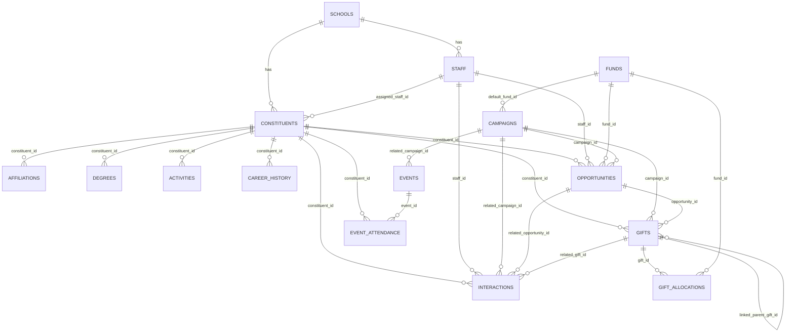

# Entity relationship diagram

```mermaid
erDiagram
  SCHOOLS ||--o{ STAFF : has
  SCHOOLS ||--o{ CONSTITUENTS : has
  STAFF ||--o{ CONSTITUENTS : assigned_staff_id
  CONSTITUENTS ||--o{ AFFILIATIONS : constituent_id
  CONSTITUENTS ||--o{ DEGREES : constituent_id
  CONSTITUENTS ||--o{ ACTIVITIES : constituent_id
  CONSTITUENTS ||--o{ CAREER_HISTORY : constituent_id
  CONSTITUENTS ||--o{ OPPORTUNITIES : constituent_id
  CONSTITUENTS ||--o{ GIFTS : constituent_id
  CONSTITUENTS ||--o{ INTERACTIONS : constituent_id
  CONSTITUENTS ||--o{ EVENT_ATTENDANCE : constituent_id
  STAFF ||--o{ OPPORTUNITIES : staff_id
  STAFF ||--o{ INTERACTIONS : staff_id
  FUNDS ||--o{ CAMPAIGNS : default_fund_id
  FUNDS ||--o{ OPPORTUNITIES : fund_id
  CAMPAIGNS ||--o{ OPPORTUNITIES : campaign_id
  CAMPAIGNS ||--o{ GIFTS : campaign_id
  CAMPAIGNS ||--o{ INTERACTIONS : related_campaign_id
  CAMPAIGNS ||--o{ EVENTS : related_campaign_id
  OPPORTUNITIES ||--o{ GIFTS : opportunity_id
  OPPORTUNITIES ||--o{ INTERACTIONS : related_opportunity_id
  GIFTS ||--o{ GIFT_ALLOCATIONS : gift_id
  FUNDS ||--o{ GIFT_ALLOCATIONS : fund_id
  GIFTS ||--o{ GIFTS : linked_parent_gift_id
  GIFTS ||--o{ INTERACTIONS : related_gift_id
  EVENTS ||--o{ EVENT_ATTENDANCE : event_id
```

Every table except `schools` also carries `school_id`. See `DATA_DICTIONARY.md` for column definitions, nullability, and interpretation rules.
